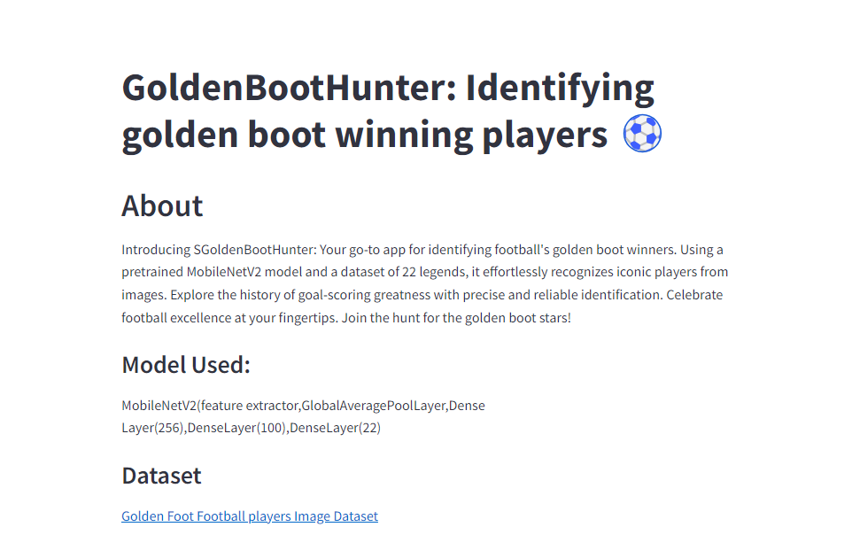
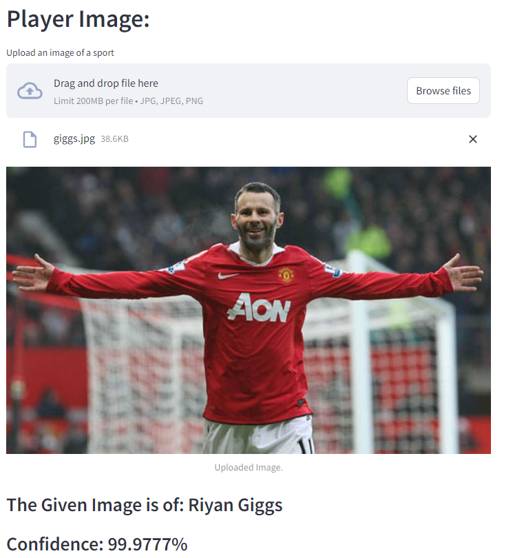
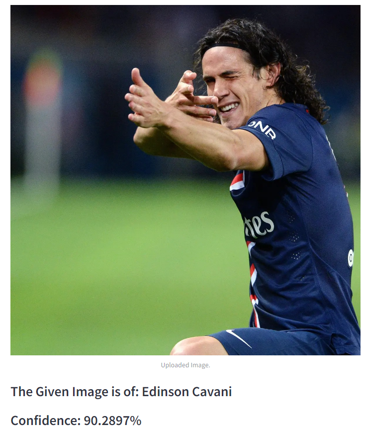

# GoldenBootHunter
Introducing GoldenBootHunter: Your go-to app for identifying football's golden boot winners. 
Using a pretrained MobileNetV2 model and a dataset of 22 legends, it effortlessly recognizes iconic players from images. Explore the history of goal-scoring greatness with precise and reliable identification.
Celebrate football excellence at your fingertips. Join the hunt for the golden boot stars!  
 **Model used:MobileNetV2(feature extractor,GlobalAveragePoolLayer,Dense Layer(256),DenseLayer(100),DenseLayer(22)**  
 **Weight used: ImageNet**  
 **Labels:**
- Alessandro Del Piero
- Andreas Iniesta
- Andriy Shevchenko
- Cristiano Ronaldo
- Didier Drogba
- Diego Maradona
- Edinson Cavani
- Francesco Totti
- Gianlugi Buffon
- Iker Casillas
- Lionel Messi
- Luka Modric
- Mohamed Salah
- Pavel Nedved
- Pele
- Riyan Giggs
- Roberto Baggio
- Roberto Carlos
- Ronaldinho
- Ronaldo Nazario
- Samuel Eto
- Zlatan Ibrahimović  
 **Dataset: [Golden Foot Football players Image Dataset](https://www.kaggle.com/datasets/balabaskar/golden-foot-football-players-image-dataset/data)**  
 **Demo:**